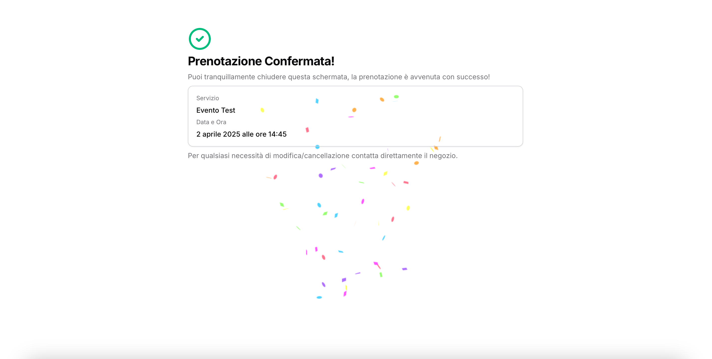

# FlowCal

FlowCal è una web app per schedulare eventi e appuntamenti con persone o singoli business.

## Tecnologie utilizzate
- **Next.js** - Framework React per lo sviluppo frontend
- **Tailwind CSS** - Libreria per lo styling
- **Supabase** - Database e backend serverless
- **Clerk** - Gestione dell'autenticazione
- **Google Calendar API** - Integrazione per sincronizzare gli eventi prenotati
- **Resend** - Servizio per l'invio delle email di conferma prenotazione

## Funzionalità principali
- Creazione e gestione di eventi e appuntamenti
- Prenotazione con conferma email automatica
- Integrazione automatica con Google Calendar per sincronizzazione eventi
- Accesso area gestionale tramite Clerk
- Interfaccia responsive e moderna

## Screenshots
### Home Page

### Pagina di Prenotazione

### Pagina di Conferma

### Area privata

### Nuovo evento

**Autore**: Matteo Roman

